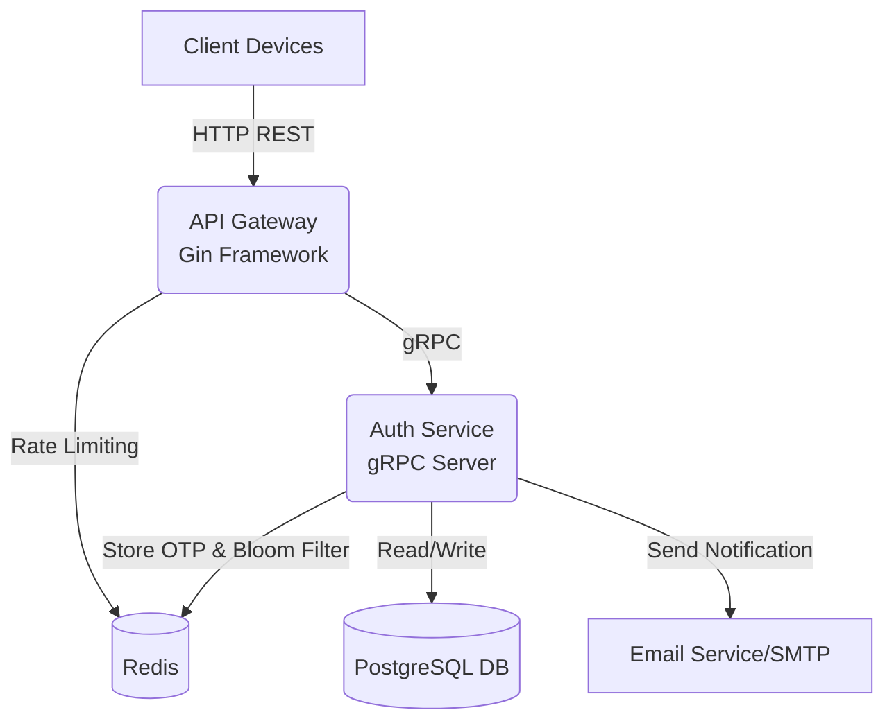
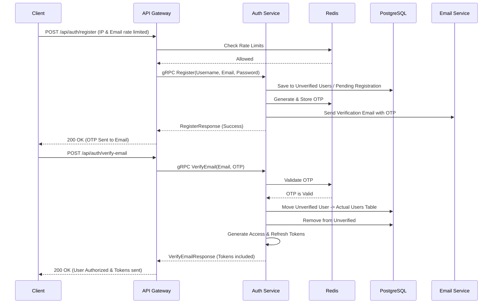
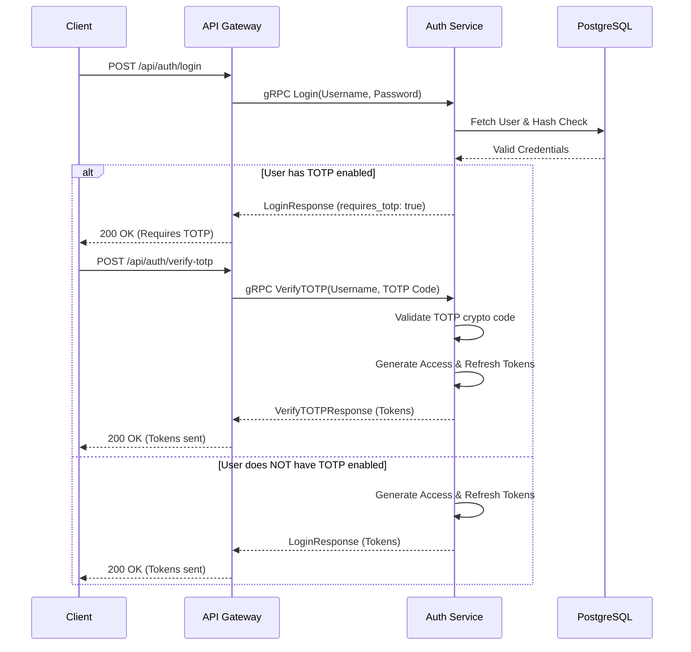
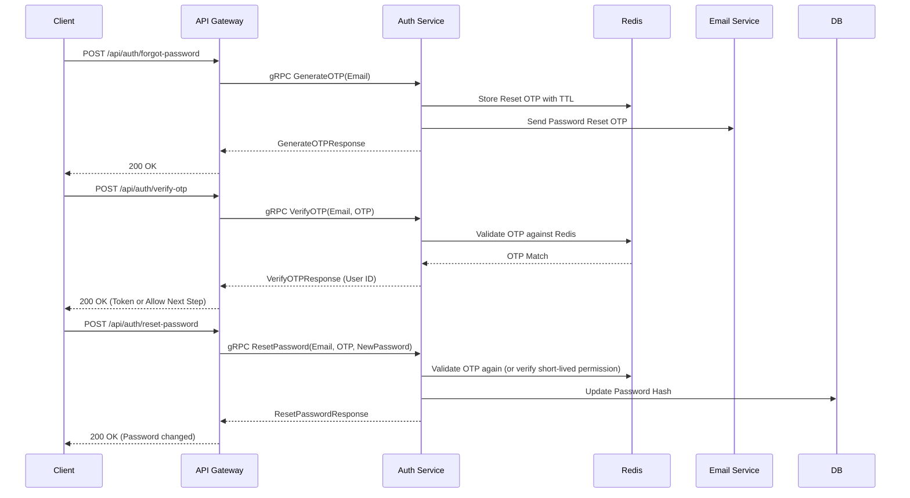
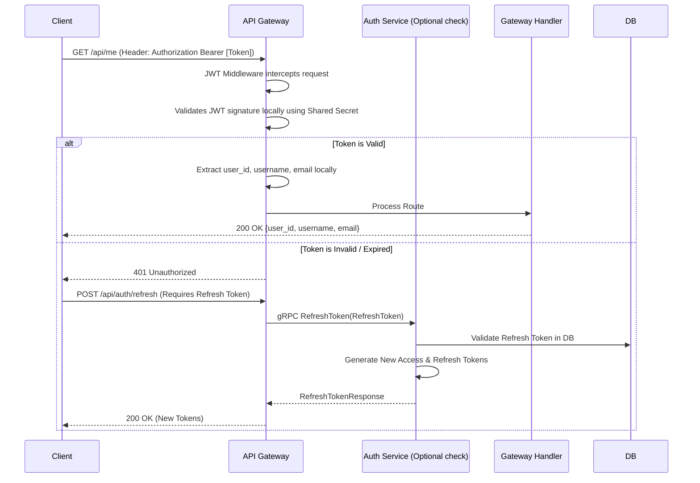
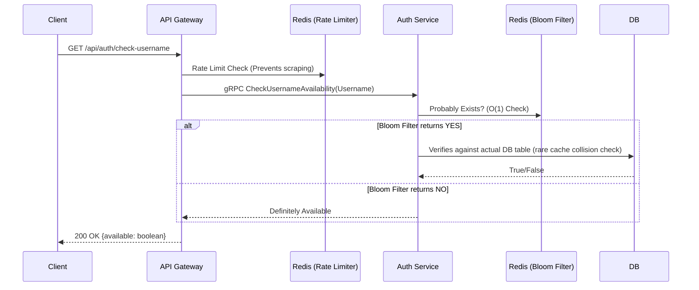

# GoConnect API Architecture and Flow Visualization

This document provides a detailed breakdown of the `GoConnect` backend architecture, explaining how different features and services interact with each other.

The application follows a **microservices-oriented architecture** using an **API Gateway pattern**. The primary communication between the Gateway and internal microservices (like the Auth service) is handled over **gRPC**.

## 1. High-Level Architecture

The core of the system is divided into moving parts:
- **Client App**: Makes HTTP/REST requests.
- **API Gateway (Gin)**: Acts as the single entry point. Handles HTTP routing, rate-limiting, CORS, and JWT authentication for protected routes.
- **Auth Service (gRPC)**: Handles business logic for user management, OTP, TOTP, and sessions.
- **Redis**: Used for Session tokens, Rate Limiting, Bloom Filters (username availability check), and OTP storage.
- **PostgreSQL Database**: Persistent storage for Users, Tokens, and Unverified Registrations.
- **Email Provider**: External SMTP server to send OTPs and verification emails.

---

## 2. Feature Interaction Flows

Below are detailed, step-by-step sequence diagrams of the major features in the platform.

### 2.1 User Registration and Email Verification Flow

When a user signs up, they are not immediately created as a verified user. They are temporarily buffered as a pending registration.

### 2.2 User Login Flow with Conditional TOTP (2FA)

If a user has 2FA enabled, the standard login acts as a pre-authorization step before full tokens are dispensed.

### 2.3 Password Reset Flow

The password reset relies on the OTP service validating identity via Email. Redis manages the expiry and lockout mechanism to prevent abuse.

### 2.4 Protected Routes and JWT Validation

Once authenticated, the Client attaches a JWT to their requests. The API Gateway verifies this token without needing to constantly ping the Auth Service unless deep verification or invalidation is required.

### 2.5 Real-Time Username Check (Bloom Filter Optimization)

To prevent hammering the database on username availability lookups, the system utilizes a **Redis Bloom Filter**.

---

## 3. Key Components in Detail

1. **API Gateway (`cmd/gateway`)**:
   - Built on `gin-gonic/gin`.
   - Protects the system using Redis sliding-window Rate Limiting middleware.
   - Converts HTTP/REST into strict Protocol Buffer requests for the inner backend logic.

2. **Auth Service (`cmd/auth`)**:
   - A standalone process completely detached from HTTP rules. Only exposes a gRPC server defined in `auth.proto`.
   - Connects to the Database layer (`pkg/db`).
   - Runs a background task `CleanupService` to constantly clear out unverified users and dead OTPs from the database to keep the system clean.
   
3. **API Shared Contracts (`api/shared`)**:
   - Single source of truth. Contains the `.proto` files allowing Gateway to understand what Auth Service expects.
   
4. **Resilience & Rate Limiting Strategy**:
   - **Signup Spam Protection**: Specifically hard limits IPs and Emails attempting to register iteratively.
   - **OTP Brute Force Protection**: Stores attempts in Redis. Generates cooldown lockouts via custom `otpService` when limits are reached.
   - **Scrape Protection**: Bloom Filters stop users from brute-forcing millions of usernames. Rate limits specifically throttle the username endpoint.
