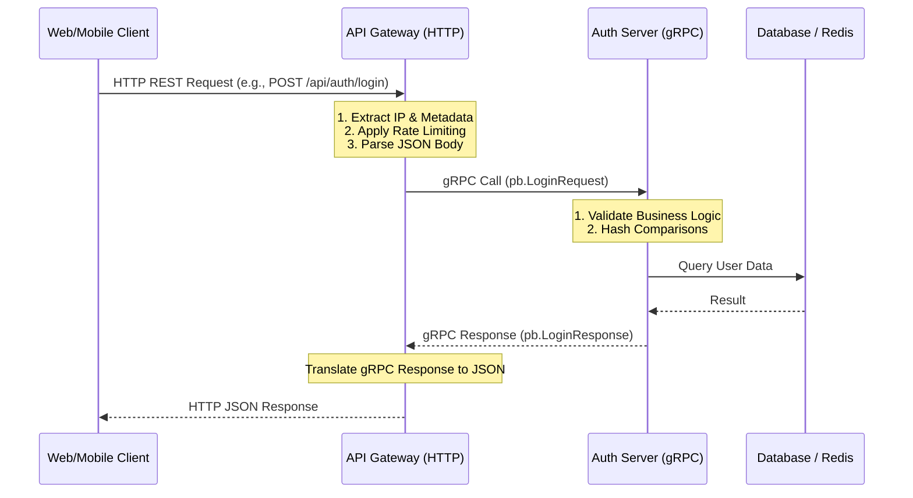
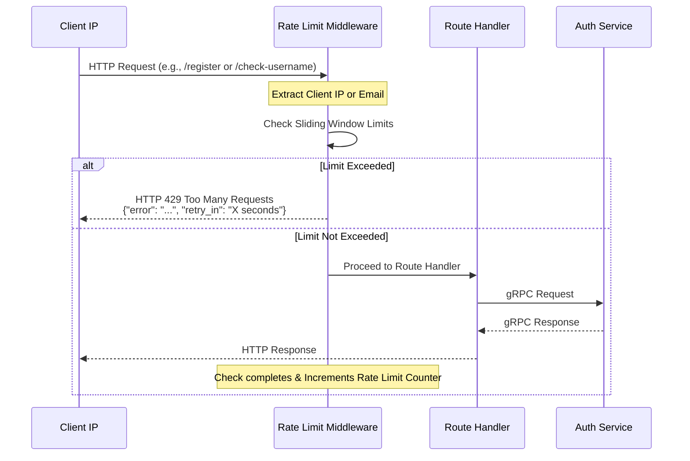
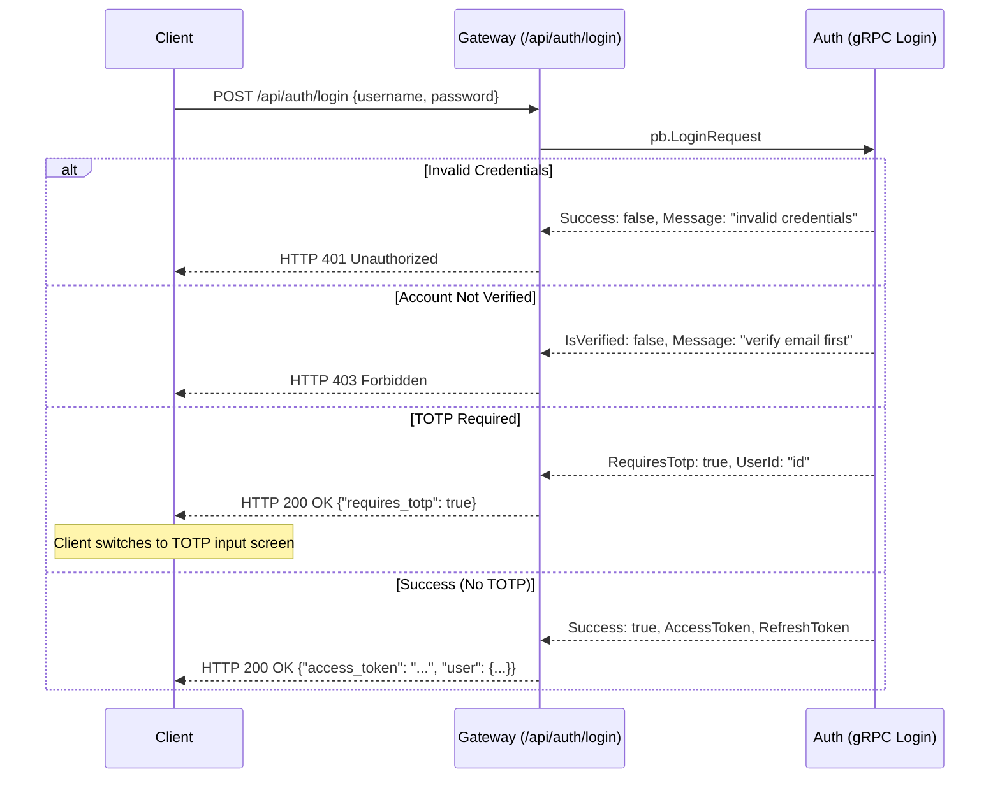
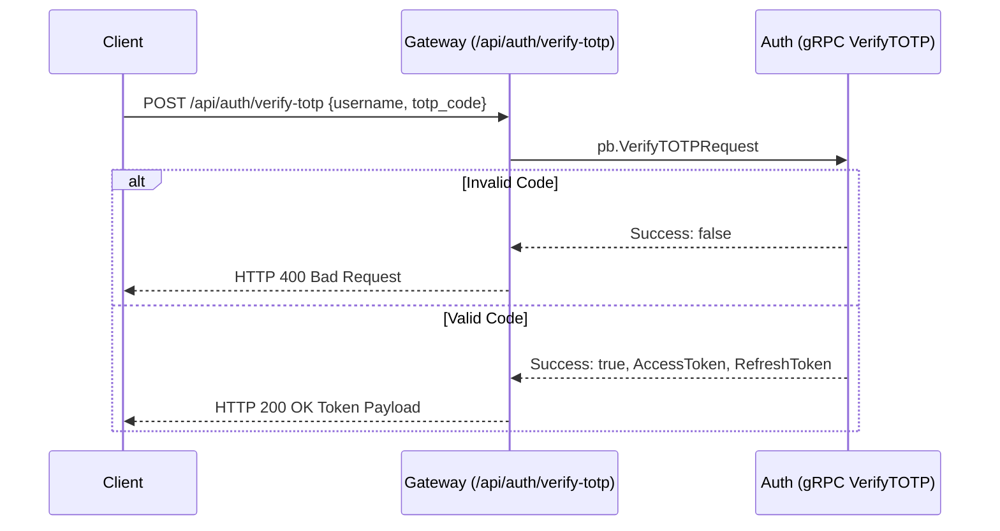
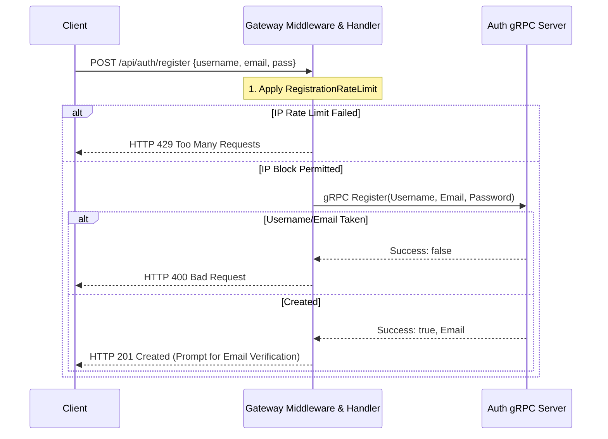
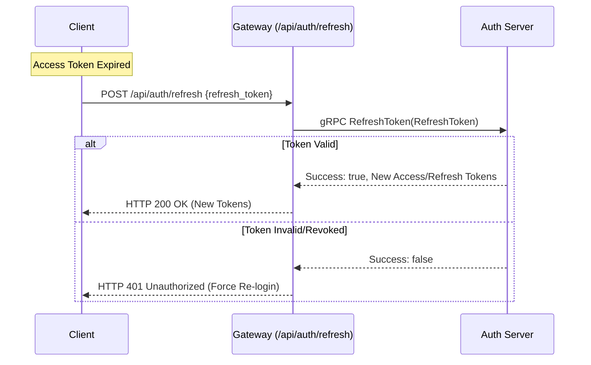

# Authentication and Gateway Server Communication Architecture

This document details how the standard Gateway Server and the Authentication (Auth) Server communicate, alongside comprehensive visual diagrams illustrating the flow of various critical APIs such as Login, Registration, and Rate Limiting.

## 1. System Communication Overview

The system employs a microservices architectural pattern where:
- **Gateway Server**: Acts as the public-facing entry point. It's an HTTP server written using the Gin framework. It handles routing, initial request validation, IP extraction, and rate limiting.
- **Auth Server**: An internal service handling the core business logic of user authentication, token generation, and account management. It exposes its services via **gRPC**.

### Gateway to Auth Communication

Communication between the Gateway and the Auth server is strictly **RPC-based** using gRPC.
1. The Gateway maintains a gRPC client connection to the Auth server.
2. Incoming HTTP JSON requests are parsed by the Gateway into internal models.
3. The Gateway invokes the appropriate gRPC method (e.g., `authClient.Login()`).
4. The Auth server processes the request (with database/redis dependencies).
5. The Auth server responds with a gRPC message.
6. The Gateway translates this gRPC response back to HTTP/JSON formats suitable for the client.

## 2. API Interaction Flows

### 2.1 Rate Limiting Architecture Details

Rate limiting is enforced exclusively at the **Gateway layer** using middleware (`internal/gateway/middleware/rate_limit.go`). It uses a Sliding Window algorithm. 
This protects the deeper Auth server and databases from spam, brute-force attacks, and distributed denial-of-service attempts.

**Key Points:**
- **Registration IP Limit**: Restricts how many accounts can be created from a single IP within a timeframe.
- **Email Request Limit**: Prevents spamming OTP codes to the same email address.
- **Username Check Limit**: Prevents malicious actors from enumerating usernames during the sign-up phase.

### 2.2 Login Flow (Including TOTP and Verification Validation)

The login process is multi-faceted. The Auth Server checks credentials, ensures the email is verified, and determines if Multi-Factor Authentication (TOTP) is mandated.

#### Secondary Login Flow: Verifying TOTP
If the login requires TOTP, a secondary request is made:

### 2.3 User Registration Flow

The registration endpoint showcases how the gateway implements IP and email limits alongside communicating with the Auth server.

### 2.4 Token Refresh Flow

Access tokens have limited lifespans for security reasons. Clients use the refresh token to maintain a session.

